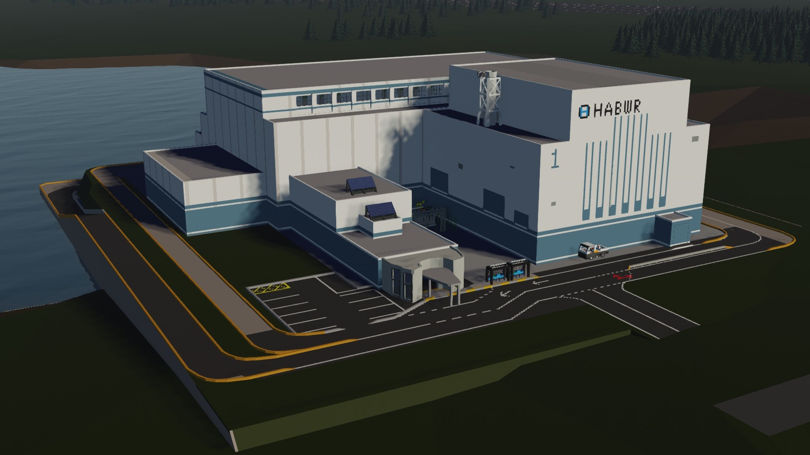

# HABWR Live Data Website

## Status: ONLINE

---

## Live Data

### Site 1

Electrical Output: **0.0 kSW**  
Thermal Power: **0.0%**  
Reactor Pressure: **158.0 kPa**  
Radiation in Containment: **2.2899637770024e-05 RU**  
Radiation in Environment: **0.0 RU**

Reactor Uptime: **0d 23h 14m**

---

<small>
Environmental radiation is measured at the vent stack.  
RU is the standard Stormworks radiation unit.
</small>

---

*Last updated: 2026-02-28 23:50 PST*
