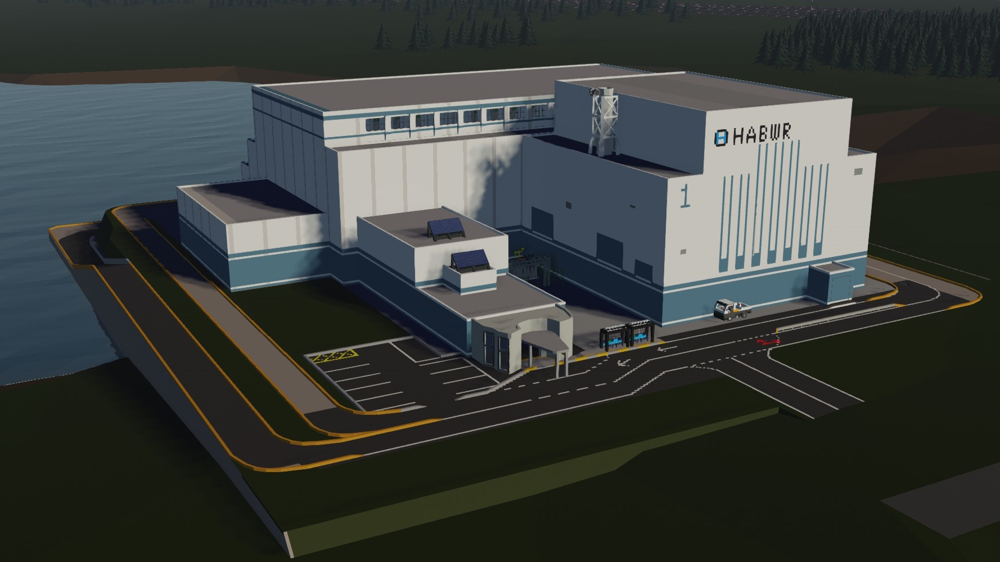

# HABWR Live Data Website

## Status: OFFLINE FOR MAINTENANCE

---

## Live Data

### Site 1

Electrical Output: **2537.0 kSW**  
Thermal Power: **63.0%**  
Reactor Pressure: **1219.0 kPa**  
Radiation in Containment: **0.0 RU**  
Radiation in Environment: **0.0 RU**

Reactor Uptime: **4d 21h 5m**

---

<small>
Environmental radiation is measured at the vent stack.  
RU is the standard Stormworks radiation unit.
</small>

---

*Last updated: 2026-03-04 21:41 PST*
